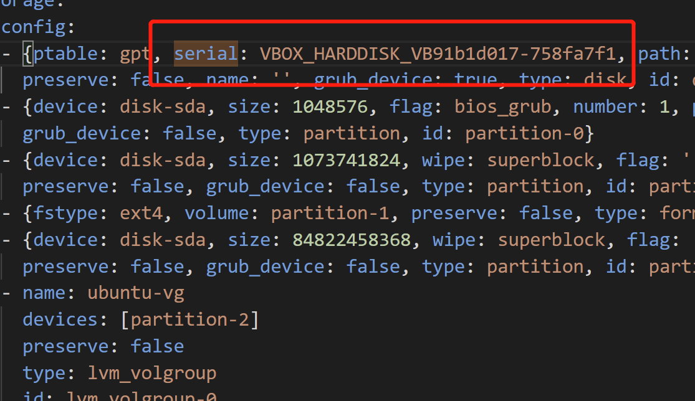

# 实验报告
## 主要操作步骤

提前下载好纯净版Ubuntu安装镜像iso文件——`ubuntu-20.04.2-live-server-amd64.iso`。并进行`校验`确认无误。

打开virtual box并新建一个虚拟机。打开设置，为刚才的虚拟机创建好双网卡。启用虚拟机，安装镜像。


手动安装后创建用户，查看`autoinstall-user_data`。


利用代码查看IP地址`cuc@192.168.56.104`
```bash
ip a
```

命令行中ssh连接cuc，查看`autoinstall-user-data`，权限受阻，重新授权，为后面从虚拟机复制到宿主机做好准备。
```bash
cat /var/log/installer/autoinstall-user-data

sudo su -

sudo chown cuc:cuc /var/log/installer/autoinstall-user-data
```


将`autoinstall-user-data`复制到宿主机并更名为`user-data`（后续发现autoinstall-user-data制作镜像文件时会产生错误，无法正常完成无人值守）
```bahs
scp cuc@192.168.56.104:/var/log/installer/autoinstall-user-data ./
```


将拷贝的`user-data`和示例配置文件进行比对，酌情修改。




在虚拟机中安装genisoimage，创建demo文件夹。


自主创建好`meta-data`文件,将user-data和meta-data传到虚拟机中去。
```bash
scp C:\Users\875999\Desktop\user-data cuc@192.168.56.104:/home/cuc/demo

scp C:\Users\875999\Desktop\meta-data cuc@192.168.56.104:/home/cuc/demo

```
在虚拟机中创建镜像，将iso复制到宿主机。
```bash
genisoimage -input-charset utf-8 -output init.iso -volid cidata -joliet -rock user-data meta-data

scp cuc@192.168.56.104:/home/cuc/demo/init.iso ./
```


再创建一个虚拟机，步骤同之前一样。除掉控制器IDE，在控制器：SATA下新建 2 个虚拟光盘，`按顺序`先挂载`ubuntu-20.04.2-live-server-amd64.iso`后挂载 `init.iso`。设置好网络，启动虚拟机，完成无人值守。


## 实验中遇到的问题

1.传入虚拟机时报错'is a directory'
利用`pwd`查看虚拟机目录路径，发现虚拟机传入路径出错
2.autoinstall-user-data生成镜像文件时无人值守失败，再次比对与示例文件后发现基本无误，尝试修改文件名发现新生成的镜像文件可以完成无人值守。